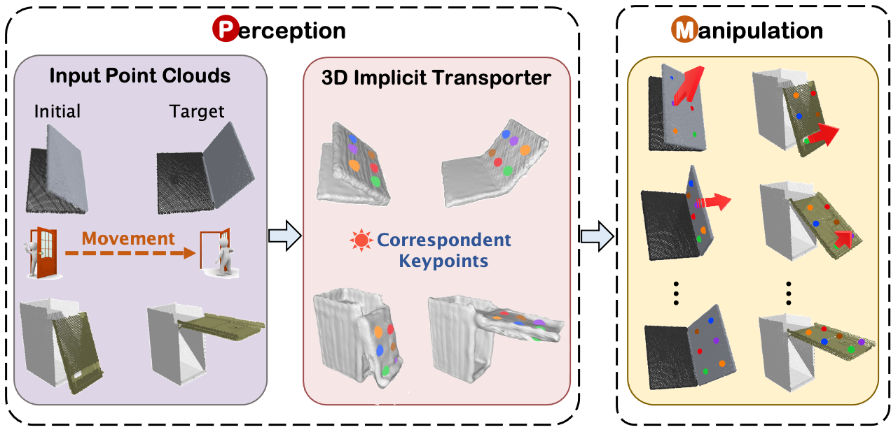
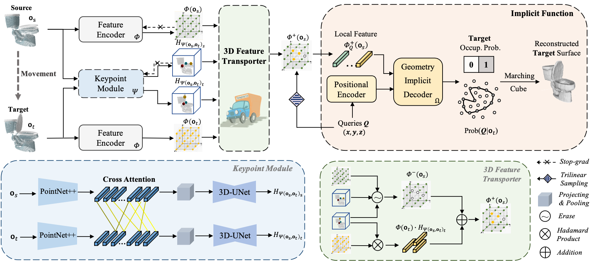

# 3D Implicit Transporter for Temporal Keypoint Discovery

This repository contains the implementation of the following [paper]():

3D Implicit Transporter for Temporal Keypoint Discovery

[Chengliang Zhong](https://zhongcl-thu.github.io/), Yuhang Zheng, [Yupeng Zheng](https://scholar.google.com/citations?user=anGhGdYAAAAJ&hl=zh-CN), [Hao Zhao](https://sites.google.com/view/fromandto), [Li Yi](https://scholar.google.com/citations?user=UyZL660AAAAJ&hl=zh-CN), Xiaodong Mu, Ling Wang, [Pengfei Li](https://scholar.google.com/citations?user=hmii_L8AAAAJ&hl=zh-CN), [Guyue Zhou](https://air.tsinghua.edu.cn/en/info/1046/1196.htm), [Chao Yang](https://scholar.google.com/citations?user=5KRbHPMAAAAJ&hl=zh-CN), Xinliang Zhang, [Jian Zhao](https://zhaoj9014.github.io/)

**In ICCV 2023 (Oral)**

<p align="center"></p>


If you find our code or paper useful, please consider citing:

```bibtex
@misc{xxxxx,
  author={Chengliang Zhong, Yuhang Zheng, Yupeng Zheng, Hao Zhao, Li Yi, Xiaodong Mu, Ling Wang, Pengfei Li, Guyue Zhou, Chao Yang, Xinliang Zhang, Jian Zhao},
  title={3D Implicit Transporter for Temporal Keypoint Discover},
  year={2023}, 
  booktitle={Proceedings of the IEEE/CVF International Conference on Computer Vision},
  pages={xxx}
}
```


## Datasets

PartNet-Mobility dataset is provided by UMPNET, which can be downloaded from [here](https://ump-net.cs.columbia.edu/download/mobility_dataset.zip).

We utilize the Pybullet simulator and object models from PartNet-Mobility dataset to generate training and test data, which can be downloaded from [here](https://drive.google.com/drive/folders/1DyXP4EQExfq7yimrXNmKO80tk_mILY8-?usp=sharing). Then, move the downloaded data into 'data' folder.

Our 'data' folder structure is as follows:

```
data
  ├── bullet_multi_joint_train
  │    ├── FoldingChair
  │    ...
  │    ├── Window
  ├── bullet_multi_joint_test
  │    ├── Box
  │    ...  
  │    ├── Window
  
```

## Installation

Make sure that you have all dependencies in place. The simplest way to do so, is to use anaconda.

You can create an anaconda environment called 3d_transporter using

```
conda create --name 3d_transporter python=3.7
conda activate 3d_transporter
```

**Note**: Install python packages according to the CUDA version on your computer:

```
# CUDA >= 11.0
pip install -r requirements_cu11.txt 
pip install torch-scatter==2.0.9
# CUDA < 11.0
pip install -r requirements_cu10.txt 
pip install torch-scatter==2.0.4
```

Next, compile the extension modules.
You can do this via

```
python setup.py build_ext --inplace
```

## Training

The architecture of our model is as follows:
<p align="center"></p>

If a directory for storing training results does not exist, run:

```
mkdir exp/train0901
```
The name 'train0901' can be modified as per your discretion.

If train on single GPU, run:

```
sh exp/train0901/train_single.sh
```

If train on multiple GPUs, modify the values of 'CUDA_VISIBLE_DEVICES' and 'nproc_per_node' in the 'train_multi.sh' according to the number of available GPUs of yours and run:

```
sh exp/train0901/train_multi.sh
```

## Extract and Save Keypoints

For seen data:

```
sh exp/train0901/test_seen.sh save_kpts
```

For unseen data:

```
sh exp/train0901/test_unseen.sh save_kpts
```

## Evaluate

### 1. Perception

Test for seen data:

```
python tools/eval_repeat.py \
--dataset_root data/bullet_multi_joint_test --test_root ${scriptDir}/test_result/seen/ \
 --test_type seen
```

Test for unseen data:

```
python tools/eval_repeat.py \
--dataset_root data/bullet_multi_joint_test --test_root ${scriptDir}/test_result/unseen/ \
 --test_type unseen
```

### 2. Manipulation
After training, one can get 'model_best.pth' in 'exp/train0901/checkpoints'. 
```
ln -s exp/train0901/checkpoints/model_best.pth manipulation/ckpts/
cd manipulation
sh eval.sh
```


## Pretrained Models

We provide pretrained models on [Google Drive](https://drive.google.com/drive/folders/14BzKmgHpf-E7YtJCDZCkkTyA81hOwFC6?usp=sharing). Move the models to *exp/train0901/checkpoints/*.

## License

Our repo is released under the MIT License.

## Acknowledgment

We would like to thank the open-source code of [UMPNET](https://github.com/columbia-ai-robotics/umpnet), [Transporter](https://github.com/ethanluoyc/transporter-pytorch), [Ditto](https://github.com/UT-Austin-RPL/Ditto), [SNAKE](https://github.com/zhongcl-thu/SNAKE) and [D3feat](https://github.com/XuyangBai/D3Feat.pytorch).
